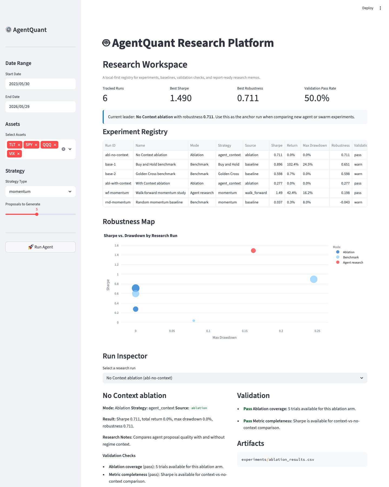
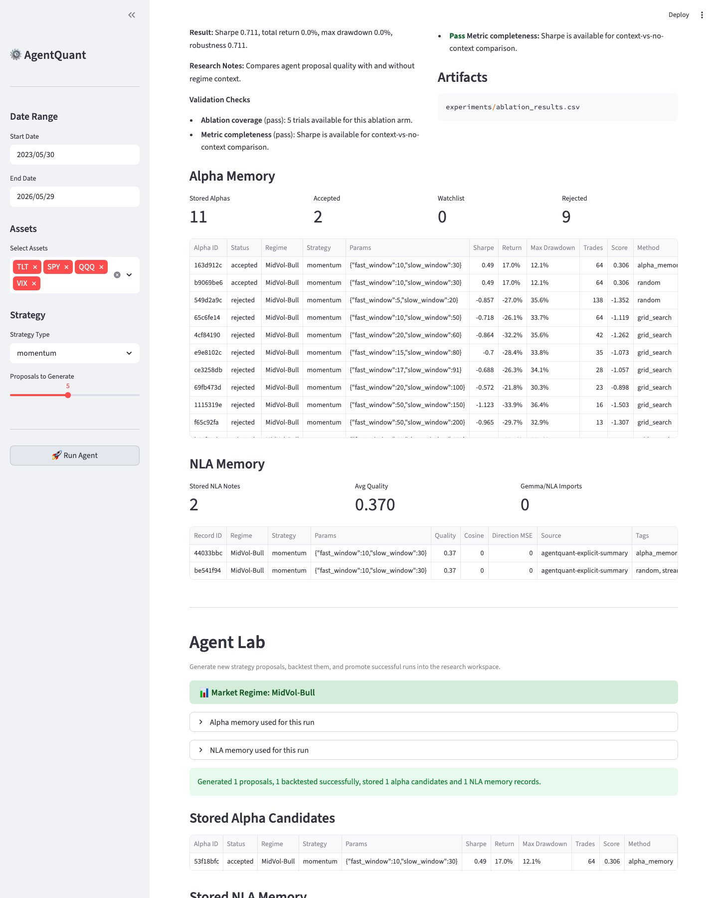
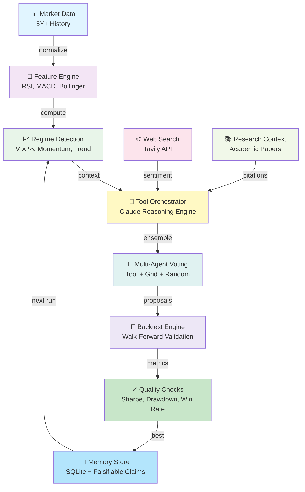

# AgentQuant: An Agent That Evolves How It Searches

[](https://github.com/OnePunchMonk/AgentQuant/actions)


> **AgentQuant does not just search for trading strategies; it evolves how it searches for them.**

Trading is the domain. Self-improving search is the point: the agent proposes,
tests, reflects, remembers failures, and evolves its research harness under
explicit evaluation gates.

## Reproduce the zero-key demo

From a clean checkout, install the package and development dependencies. No API
keys are required for the local demo. It uses deterministic synthetic market
data and the grid/random fallback path, then writes a JSON report and an
equity-curve artifact to `results/`:

```bash
python -m venv .venv
source .venv/bin/activate       # Windows: .venv\\Scripts\\activate
python -m pip install --upgrade pip
python -m pip install -e ".[dev]"
python run_app.py
```

The demo validates installation, the core search loop, metric calculation, and
artifact generation; it does not establish live-trading performance.

To launch the interactive Streamlit app instead:

```bash
python run_app.py --app
```

Add `ANTHROPIC_API_KEY` and `TAVILY_API_KEY` later to unlock optional
LLM-guided proposals and web research; the core loop remains runnable without
them.

For the complete human explanation of the project’s evolution, see
[LEARNINGS.md](LEARNINGS.md). For a full worked narrative of one run, see
[docs/SELF_IMPROVING_SEARCH.md](docs/SELF_IMPROVING_SEARCH.md).

## Read, run, and extend

| Start here | Link |
|---|---|
| Human learnings from the full project history | [LEARNINGS.md](LEARNINGS.md) |
| Worked explanation of the self-improving search loop | [SELF_IMPROVING_SEARCH.md](docs/SELF_IMPROVING_SEARCH.md) |
| Technical architecture | [DESIGN.md](DESIGN.md) |
| Feature and release history | [CHANGELOG.md](CHANGELOG.md) |
| Zero-key local demo | [`run_app.py`](run_app.py) |
| Reproducible search benchmark | [`scripts/reproducible_benchmark.py`](scripts/reproducible_benchmark.py) |
| Harnesskit replay contract | [`harnesskit_spec/`](harnesskit_spec/) |
| Peek leakage audit | [`scripts/peek_audit_benchmark.py`](scripts/peek_audit_benchmark.py) |
| Agent harness evaluation toolkit | [OnePunchMonk/harnesskit](https://github.com/OnePunchMonk/harnesskit) |
| Time-series leakage auditor | [OnePunchMonk/peek](https://github.com/OnePunchMonk/peek) |

## Harnesskit integration

AgentQuant can export its execution trace to
[harnesskit](https://github.com/OnePunchMonk/harnesskit), which supplies a
framework-neutral trajectory schema and offline replay/evaluation contracts.
This keeps market-specific research in AgentQuant while moving harness
diagnostics and regression checks into a reusable evaluation layer.

```bash
pip install -e ../harnesskit
python scripts/export_harnesskit_trace.py
harness replay harnesskit_spec --baseline results/demo_run.trajectory.json
```

The bridge is optional; AgentQuant still runs without harnesskit. The exported
trajectory records proposal-generation steps, agent-loop stages, termination,
and payloads in a format that can be replayed without another model call.

Before interpreting benchmark results, audit the deterministic fixture with
[Peek](https://github.com/OnePunchMonk/peek):

```bash
git clone https://github.com/OnePunchMonk/peek ../peek
PYTHONPATH=../peek .venv/bin/python scripts/peek_audit_benchmark.py
```

The command writes `results/peek_audit.json` and exits non-zero if Peek finds a
leak. Leakage detection is therefore a prerequisite for interpreting harness
comparisons.

## What Makes This Different

Most trading agent frameworks are static parameter-tuning tools. **AgentQuant is different:**

- ✅ **Runs a real ReAct loop** — analyze → hypothesize → backtest → reflect → store → improve
- ✅ **Remembers across runs** — Cross-session SQLite memory lets the agent learn what worked
- ✅ **Measures generalization** — Tracks overfitting risk with explicit train/validation/test splits
- 🧪 **Includes experimental optimizers** — Genetic algorithms and differential evolution can search harness parameters; their benchmark currently uses a mock fitness function
- ✅ **Records falsifiable claims** — Proposals can include confidence and written outcome claims for later analysis; no calibrated Sharpe-prediction-accuracy metric is reported
- ✅ **Integrates web search** — Uses Tavily to find market sentiment and strategy research in real-time
- ✅ **Research-grade engineering**: automated tests, CI checks, security checks, and look-ahead bias guards

---

## Evidence Table

Numbers in this repo come from three tiers of evidence that must not be conflated.
Regenerate this table with `scripts/harness_evolution_6_epochs.py` (fixture/measured
historical rows) and `scripts/reproducible_benchmark.py` (fixture/demo rows); each
run writes a manifest under `experiments/run_manifests/` and a results JSON that
this table should link back to.

| Tier | What it means | Example | Source (command / file) |
|------|---------------|---------|--------------------------|
| **Fixture / demo** | Deterministic synthetic price paths, offline, no API keys. Useful for testing wiring (config threading, holdout mechanics), not for judging strategy quality. | `reproducible_benchmark.py` 1-vs-3-iteration holdout Sharpe comparison | `python3 scripts/reproducible_benchmark.py --output results/reproducible_benchmark.json` |
| **Measured historical experiment** | Real OHLCV history (yfinance), an actual `run_agent`/epoch execution, with in-sample search Sharpe reported separately from held-out Sharpe. Still a single historical window, not a claim about future/live performance. | 6-epoch harness evolution runs, each producing a `HarnessConfig` hash + run manifest | `python3 scripts/harness_evolution_6_epochs.py --strategy momentum --output results.json` |
| **Unverified legacy** | Numbers that appeared in earlier revisions of this README/results docs without an attached command, manifest, or seed. Treat as anecdotal until reproduced; do not cite as validation. | Prior "Live Results" table (removed) | none — this is exactly the gap this section replaces |

**What the code actually measures today, and what it doesn't:**
- ✅ Search-set Sharpe and holdout-set Sharpe are reported separately (`agent_graph.holdout_eval_node`); the generalization gap is `search_sharpe - holdout_sharpe` on the *same* winning proposal, and is reported as `unavailable` (not 0.0) when no holdout evaluation ran.
- ✅ Run outcome is one of `passed_quality_gate`, `budget_exhausted`, `no_valid_candidate`, or `execution_failed` — "we ran out of iterations and kept the best guess" is never reported as having passed the quality gate.
- ✅ GA/DE optimizer comparisons (see `docs/EVOLUTIONARY_HARNESS_OPTIMIZATION.md`) use a **mock fitness function**, not real backtests — treat any GA/DE numbers as algorithm-search behavior, not trading performance.
- ❌ There is no calibrated numerical Sharpe-forecast-accuracy metric yet; falsifiable claims are recorded as text, not scored against realized outcomes.
- ❌ "Tool calls per epoch" is a raw count, not an efficiency ratio; a change in tool-call count alone is not evidence of an efficiency improvement and should not be reported as one (the previous "8x efficiency" framing has been removed for this reason).

### UI & Dashboards


*Live backtest dashboard with strategy performance metrics*


*Research workspace tracking experiments and prior learnings*


*Cross-session memory of tested strategies and results*

---

## Harness Architecture (v6_research)



**Implemented Features:**
- ✅ **Tool Orchestration** — Claude reasons over market context, web search, and research; a resolved, versioned harness config gates tool admission (disabling tools yields zero tool-orchestrator calls) and prompt content
- 🧪 **Multi-Agent Ensemble** — Planned (epochs 5-6 in the harness sequence); the runtime currently rejects a harness config that requests ensemble voting (`use_ensemble=True`) with an explicit `UnsupportedHarnessKnobError` rather than silently ignoring it, since it is not wired through yet
- ✅ **Walk-Forward Validation** — A trailing holdout window is carved out before the search loop runs and is scored exactly once (`holdout_eval_node`), separate from in-sample search Sharpe
- ✅ **Memory Persistence** — Learns which strategies work in which market regimes
- ✅ **Falsifiable Claims** — Proposals record a written, falsifiable claim and confidence score; numerical Sharpe-forecast accuracy against realized outcomes is not yet computed or reported (no accuracy percentage should be cited until that scoring exists)

---

## How It Works

### The ReAct Loop

```
1. ANALYZE
   • Load price data + compute features
   • Detect market regime (VIX percentile, momentum, trend)
   • Build RegimeContext with signals, volatility, regime label

2. HYPOTHESIZE (New: With Tool Orchestration)
   • Call Claude with tool schemas (regime context, web search, parameter grid)
   • Tools gather market data, search strategy research
   • Claude reasons over tool results, proposes parameter sets
   • Proposals validated against canonical parameter grid
   • If tools unavailable, fall back to grid search

3. BACKTEST
   • Tournament: test all proposals on historical data
   • Compute Sharpe, Calmar, Sortino, max drawdown, win rate
   • Enforce look-ahead bias guards (warmup periods enforced)
   • Apply realistic costs (slippage, commission, market impact)

4. REFLECT
   • Score results: is Sharpe ≥ threshold?
   • Record falsifiable claims for later analysis (numerical forecast accuracy is not yet calibrated)
   • If below threshold, retry up to max_iterations
   • Score proposals for generalization risk

5. STORE
   • Persist best result to SQLite memory
   • Save strategy run with metrics, parameters, regime
   • Next run retrieves similar-regime history for context
```

### What's New: Self-Improving Harness

The system itself evolves across epochs:

```
Epoch 1: Grid search only                  (use_tools=False)               -- implemented
Epoch 2: Enable tools + Claude reasoning    (use_tools=True)                -- implemented
Epoch 3: Tune prompt based on v2 learnings  (prompt_template changed)       -- implemented
Epoch 4: Adapt grid to high-performers      (grid_adaptation_strategy)      -- NOT wired: runtime raises
Epoch 5: Add multi-agent voting             (use_ensemble=True)             -- NOT wired: runtime raises
Epoch 6: Deploy research agent              (prompt_template + ensemble)    -- prompt change only
```

Epochs 1-3 change agent behavior through the resolved harness config (tool admission and
prompt content). Epochs 4-6 as originally specified also requested grid adaptation and
ensemble voting; those knobs are not implemented in the runtime yet, so
`resolve_effective_config` raises `UnsupportedHarnessKnobError` for them rather than
silently no-opping. Run `scripts/harness_evolution_6_epochs.py` to see this: it catches
the error, records it in the epoch checkpoint's `config_error` field, and re-runs that
epoch with only the supported knobs so the comparison table still has a number for every
epoch -- but the epoch-over-epoch Sharpe delta for epochs 4-6 should not be read as
evidence that grid adaptation or ensemble voting help, since neither actually ran.

Each epoch's config (requested and effective, with a content hash) is saved in the
run's output JSON and in `experiments/run_manifests/<run_id>.json`.

---

## Installation

### Requirements
- Python 3.10+
- ~5 years of market data (auto-fetched from yfinance)

### Setup

```bash
# Clone repo
git clone https://github.com/OnePunchMonk/AgentQuant.git
cd AgentQuant

# Install with all extras
pip install -e ".[dev,llm]"

# Set API keys (optional; agent degrades gracefully without them)
cp .env.example .env
export ANTHROPIC_API_KEY=sk-...      # For Claude tool-use
export TAVILY_API_KEY=tvly-...       # For web search
export GOOGLE_API_KEY=...            # Fallback LLM
```

### Verify Setup

```bash
python scripts/verify_tools.py
```

---

## Quick Start

### Run 6-Epoch Harness Evolution

```bash
python scripts/harness_evolution_6_epochs.py \
  --strategy momentum \
  --asset SPY \
  --epochs 6

# Output: evolution results with metrics progression
# Saves: evolved harness configs to .harness/
```

### Benchmark Algorithms

```bash
python scripts/benchmark_harness_evolution.py \
  --strategy momentum

# Compares: Manual vs experimental GA vs experimental DE vs Random
# Output: JSON report based on a mock fitness function (not backtests)
```

### Fair Search Benchmark (P1) and Bounded Self-Improvement (P2)

```bash
# P1: compare arms (fixed / random_search / grid_search / frozen_agent /
# frozen_agent_memory) on identical chronological dev/holdout episode
# splits, with a uniform transaction-cost model and >=3 seeds per arm.
python scripts/fair_search_benchmark.py --episodes 3 --seeds 7 11 19 \
  --output results/fair_search_benchmark.json

# P2: outer-loop policy mutation (mutates prompt_template/prompt_context)
# evaluated on dev episodes, selected on a validation episode, promoted
# only if it clears a fixed Sharpe-improvement threshold without regressing
# on a protected episode, then frozen-graded once on final holdout episodes.
# Also runs a random-mutation baseline and memory-disabled/shuffled-memory
# ablations under the identical budget.
python scripts/bounded_self_improvement.py --episodes 6 --seeds 7 11 19 \
  --n-mutations 3 --output results/bounded_self_improvement.json
```

Both scripts run offline on deterministic synthetic OHLCV data by default
(no API keys needed) and are development benchmarks, not claims about live
or historical trading performance.

- **Arms** (`src/agent/search_arms.py`): `fixed` is buy-and-hold; `random_search`
  and `grid_search` are non-agent baselines over the momentum parameter grid;
  `frozen_agent` runs the existing propose→backtest→reflect loop
  (`src/agent/agent_graph.py`) once per episode with a fresh, empty memory
  snapshot each time; `frozen_agent_memory` gives that same loop read access
  to memory written by strictly earlier episodes only (never future ones —
  see `filter_visible_memory`).
- **Episode splits** (`src/agent/episode_splits.py`): chronological
  (dev-window, sealed-holdout-window) pairs generated once and persisted to
  JSON so every arm is graded on identical windows. A fixed bps-per-trade
  transaction cost (`apply_transaction_costs`) is applied uniformly.
- **Reported per arm/episode**: held-out net return after costs, max
  drawdown, turnover, search efficiency (return per attempted candidate),
  cross-seed mean/std, and full candidate logs (including failed attempts,
  which count in the denominator of the success rate). Missing/failed
  outcomes are reported as `"missing"`, never coerced to 0.
- **Promotion criterion** (`src/agent/policy_mutation.py`): a candidate
  policy is only promoted over the incumbent if its mean validation-episode
  holdout Sharpe beats the incumbent's by more than `PROMOTION_EPSILON`
  (0.10) AND it doesn't regress by more than `MAX_PROTECTED_REGRESSION`
  (0.25) on a reserved protected episode. Ties, losses, and inconclusive
  deltas keep the incumbent — persisting a new config is never itself
  treated as improvement. The final holdout episodes can only be used for
  one frozen grading pass per run (`FinalHoldoutGuard` errors loudly on
  reuse).

### Research Workspace: Episode Narrative, Candidate Inspection, Policy Diff (P3)

```bash
# Runs one P2 bounded-self-improvement episode fresh (offline, synthetic
# data) and exports a self-contained research memo from the real
# persisted/returned artifacts.
python scripts/export_research_memo.py --episodes 6 --seeds 7 11 19 \
  --n-mutations 3 --output results/research_memo
# writes results/research_memo.md and results/research_memo.json
```

`scripts/export_research_memo.py` currently supports **"run fresh"** only
(it runs one episode end-to-end and exports the memo from the result); a
**"replay from an existing run manifest"** mode is deferred until the
episode result is persisted as its own artifact (today it's only returned
in-process and partially mirrored into the run manifest) — see the
module docstring for details.

The memo (`src/agent/research_memo.py`, built on
`src/agent/episode_report.py`) tells one complete episode's story in
order: **hypothesis** (the proposed mutation, its diagnosis, and expected
benefit) → **evidence available at the time** (memory visible at decision
time, reusing `filter_visible_memory` from P1 to prove no future-dated
leakage) → **experiment** (dev/validation/protected-episode scores,
linked to a `RunManifest` and config hash so it's rerunnable) →
**rejection/acceptance** (the `evaluate_promotion` decision with the
actual epsilon/delta numbers, not just a verdict) → **policy change** (old
policy hash → new policy hash if promoted, or an explicit "incumbent
retained" statement) → **fresh result**, labeled by evidentiary tier using
the same fixture/demo, measured-historical-experiment, unverified-legacy
vocabulary as the Evidence Table above, and explicitly stating when an
episode was *not* graded on final holdout data. Any field the generator
can't find in the supplied inputs is rendered as an explicit "unavailable"
note rather than being invented or silently dropped.

Unsuccessful candidates are not discarded: `src/agent/episode_report.py`'s
`list_candidates` / `candidates_report` list every attempted mutation for
an episode (win or lose) with a one-line rejection reason — "not
selected as best-on-dev" vs. "best-on-dev but failed promotion check" are
distinguished — and `compare_policies` produces a structured diff (changed
vs. unchanged config fields, plus a metrics diff where both sides carry
metrics) between any two `HarnessConfig` dicts, e.g. incumbent vs.
candidate.

Out of scope here (per issue #28's own stated ordering): prospective/live
paper-trading research. That's deferred until this experiment contract —
episode narrative, candidate inspection, policy diff, memo export — is
stable.

### Run Agent (Streamlit UI)

```bash
streamlit run src/app/streamlit_app.py
```

Interactively run the agent on chosen date ranges and assets.

---

## Architecture

### Core Agent (`src/agent/`)
- `agent_graph.py` — ReAct loop orchestration (5 typed nodes)
- `proposal_generator.py` — LLM → Grid → Random fallback
- `harness_config.py` — Editable harness parameters (v1-v6)
- `harness_evolution_algo.py` — Genetic Algorithm + Differential Evolution
- `tools/registry.py` — 5 composable tools for orchestration
- `tools/orchestrator.py` — Claude tool-use loop
- `tools/evals.py` — Quality assessment benchmark

### Memory (`src/research/`)
- `alpha_store.py` — Persist alpha candidates with citations
- `nla_memory.py` — Explicit NLA-style research narratives
- `workspace.py` — Experiment registry + research memos

### Backtesting (`src/backtest/`)
- `runner.py` — Unified backtest engine with look-ahead guards
- `metrics.py` — Single source of truth for all performance metrics

### Strategies (`src/strategies/`)
- 6 registered strategies: momentum, mean_reversion, volatility, trend_following, breakout, multi_strategy
- Canonical parameter grids per strategy

### Features (`src/features/`)
- `regime.py` — VIX percentile-based regime detection
- `engine.py` — Technical indicators (RSI, MACD, Bollinger, ATR)
- `lookback_guard.py` — Prevents look-ahead bias

---

## What's in the Box

### Results (Latest Run)
- `results/harness_evolution_6epochs_results.json` — Epoch-by-epoch metrics
- `results/benchmark_report.json` — Algorithm comparison
- `HARNESS_EVOLUTION_RESULTS.md` — Full analysis + findings

### Evolved Harnesses
Sharpe figures for saved harness configs are tied to a specific historical run and
seed; see the Evidence Table above and the run manifest referenced by each result
file before citing a number from here.
- `.harness/v6_research.json` — Latest research harness config (requested + effective settings)
- `.harness/v_ga_optimal.json` — GA-optimized on the mock fitness function (not a backtest result)
- `.harness/v_de_optimal.json` — DE-optimized on the mock fitness function (not a backtest result)

### Documentation
- `docs/TOOL_INTEGRATION_GUIDE.md` — Tool orchestration system
- `docs/EVOLUTIONARY_HARNESS_OPTIMIZATION.md` — Algorithm details + theory
- `docs/RESEARCH_AGENT_DESIGN.md` — Research agent roadmap (in progress)
- `DESIGN.md` — Architecture & design rationale
- `CHANGELOG.md` — Version history

### Tests
```bash
pytest tests/
# 82 tests covering (count as of this branch; re-run `pytest tests/ -q` to reconfirm):
# - Agent loop correctness
# - Backtest metrics (hand-verified against numpy)
# - Regime detection
# - Memory persistence
# - Proposal generation
# - Config validation
```

---

## Limitations & Honesty

### What This Does
✅ Discovers regime-aware trading parameters  
🧪 Includes experimental iterative harness optimization
✅ Remembers across runs (SQLite memory)  
✅ Backtests with realistic costs  
✅ Integrates web search for context  
✅ Validates generalization (train/test split)  

### What This Doesn't Do
❌ Predict future prices (impossible)  
❌ Guarantee profit (backtest ≠ live trading)  
❌ Report calibrated numerical Sharpe forecasts or use GA/DE benchmark output as backtest evidence
❌ Beat the market (we haven't shipped live yet)  
❌ Work without data (needs 5y+ history minimum)  
❌ Replace a professional researcher (it's a tool)  

### Key Caveats
- **Backtesting bias is real.** We measure generalization gap and validate on held-out windows, but 5 years of data is small. Use walk-forward validation before deploying.
- **Sharpe ratio can overfit.** We track max drawdown, win rate, and Calmar ratio too.
- **LLM proposals are not guaranteed.** Claude sometimes outputs invalid JSON; we validate and fall back gracefully.
- **Market regimes change.** Today's optimal parameters may not work tomorrow; the agent re-learns each run.
- **This is research-grade, not production-grade trading.** Paper trading first; live only with careful risk management.

---

## Contributing

Interested in improving AgentQuant? Check out [CONTRIBUTING.md](CONTRIBUTING.md) for:
- Setup instructions
- Testing & code standards
- High-priority areas for contribution (Research Agent is next!)
- Ideas for future work

---

## Research & References

### Harness Evolution Papers
- Weng et al. (2026) — [Harness Engineering for Self-Improvement](https://lilianweng.github.io/posts/2026-07-04-harness/)
- arXiv:2607.07663 — Recursive Self-Improvement in AI
- arXiv:2607.12227 — Rethinking Harness Evolution Evaluation

### Quantitative Research
- Walk-forward validation methodology
- Look-ahead bias prevention techniques
- Regime detection (VIX percentile vs. absolute)

---

## Citation

If you use AgentQuant in research, cite:

```bibtex
@software{agentquant_2026,
  title={AgentQuant: Self-Improving Agent for Quantitative Research},
  author={OnePunchMonk},
  year={2026},
  url={https://github.com/OnePunchMonk/AgentQuant}
}
```

---

## License

MIT — Use freely, modify as needed, mention if you find bugs.

---

## Status

✅ **Alpha 0.2.0** — Core agent + harness evolution complete  
🔄 **Beta roadmap** — Research agent, multi-objective optimization  
⚠️ **Not yet production** — Backtest results don't guarantee live returns  

**Latest:** Harness config threading, run-status separation (`passed_quality_gate` / `budget_exhausted` /
`no_valid_candidate` / `execution_failed`), and a real search-vs-holdout generalization gap are implemented
and covered by tests (see Evidence Table above). Epoch-over-epoch Sharpe deltas from a specific historical
run are reported in that run's manifest/results JSON, not as a standing README claim.

---

**Questions? Open an issue or read `docs/` for deeper dives.**
