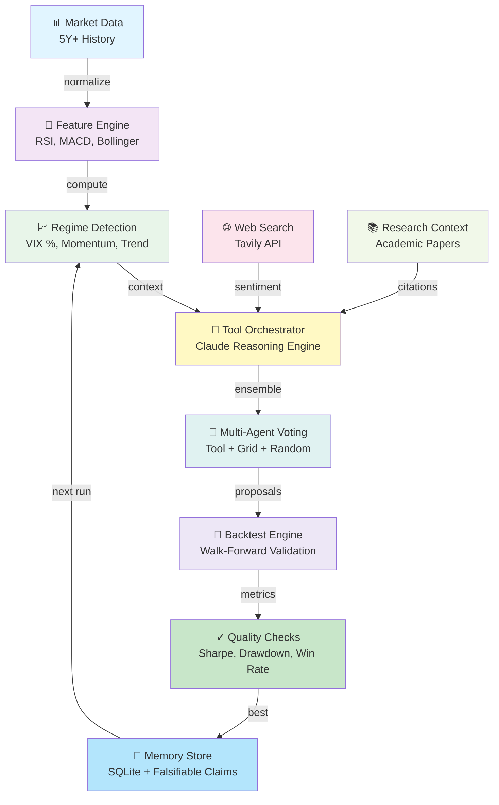

# AgentQuant: An Agent That Evolves How It Searches

[](https://github.com/OnePunchMonk/AgentQuant/actions)


> **AgentQuant does not just search for trading strategies; it evolves how it searches for them.**

Trading is the domain. Self-improving search is the point: the agent proposes,
tests, reflects, remembers failures, and evolves its research harness under
explicit evaluation gates.

## Reproduce the zero-key demo

From a clean checkout, install the package and development dependencies. No API
keys are required for the local demo. It uses deterministic synthetic market
data and the grid/random fallback path, then writes a JSON report and an
equity-curve artifact to `results/`:

```bash
python -m venv .venv
source .venv/bin/activate       # Windows: .venv\\Scripts\\activate
python -m pip install --upgrade pip
python -m pip install -e ".[dev]"
python run_app.py
```

The demo validates installation, the core search loop, metric calculation, and
artifact generation; it does not establish live-trading performance.

To launch the interactive Streamlit app instead:

```bash
python run_app.py --app
```

Add `ANTHROPIC_API_KEY` and `TAVILY_API_KEY` later to unlock optional
LLM-guided proposals and web research; the core loop remains runnable without
them.

For the complete human explanation of the project’s evolution, see
[LEARNINGS.md](LEARNINGS.md). For a full worked narrative of one run, see
[docs/SELF_IMPROVING_SEARCH.md](docs/SELF_IMPROVING_SEARCH.md).

## Read, run, and extend

| Start here | Link |
|---|---|
| Human learnings from the full project history | [LEARNINGS.md](LEARNINGS.md) |
| Worked explanation of the self-improving search loop | [SELF_IMPROVING_SEARCH.md](docs/SELF_IMPROVING_SEARCH.md) |
| Technical architecture | [DESIGN.md](DESIGN.md) |
| Feature and release history | [CHANGELOG.md](CHANGELOG.md) |
| Zero-key local demo | [`run_app.py`](run_app.py) |
| Reproducible search benchmark | [`scripts/reproducible_benchmark.py`](scripts/reproducible_benchmark.py) |
| Harnesskit replay contract | [`harnesskit_spec/`](harnesskit_spec/) |
| Peek leakage audit | [`scripts/peek_audit_benchmark.py`](scripts/peek_audit_benchmark.py) |
| Agent harness evaluation toolkit | [OnePunchMonk/harnesskit](https://github.com/OnePunchMonk/harnesskit) |
| Time-series leakage auditor | [OnePunchMonk/peek](https://github.com/OnePunchMonk/peek) |

## Harnesskit integration

AgentQuant can export its execution trace to
[harnesskit](https://github.com/OnePunchMonk/harnesskit), which supplies a
framework-neutral trajectory schema and offline replay/evaluation contracts.
This keeps market-specific research in AgentQuant while moving harness
diagnostics and regression checks into a reusable evaluation layer.

```bash
pip install -e ../harnesskit
python scripts/export_harnesskit_trace.py
harness replay harnesskit_spec --baseline results/demo_run.trajectory.json
```

The bridge is optional; AgentQuant still runs without harnesskit. The exported
trajectory records proposal-generation steps, agent-loop stages, termination,
and payloads in a format that can be replayed without another model call.

Before interpreting benchmark results, audit the deterministic fixture with
[Peek](https://github.com/OnePunchMonk/peek):

```bash
git clone https://github.com/OnePunchMonk/peek ../peek
PYTHONPATH=../peek .venv/bin/python scripts/peek_audit_benchmark.py
```

The command writes `results/peek_audit.json` and exits non-zero if Peek finds a
leak. Leakage detection is therefore a prerequisite for interpreting harness
comparisons.

## What Makes This Different

Most trading agent frameworks are static parameter-tuning tools. **AgentQuant is different:**

- ✅ **Runs a real ReAct loop** — analyze → hypothesize → backtest → reflect → store → improve
- ✅ **Remembers across runs** — Cross-session SQLite memory lets the agent learn what worked
- ✅ **Measures generalization** — Tracks overfitting risk with explicit train/validation/test splits
- 🧪 **Includes experimental optimizers** — Genetic algorithms and differential evolution can search harness parameters; their benchmark currently uses a mock fitness function
- ✅ **Records falsifiable claims** — Proposals can include confidence and written outcome claims for later analysis; no calibrated Sharpe-prediction-accuracy metric is reported
- ✅ **Integrates web search** — Uses Tavily to find market sentiment and strategy research in real-time
- ✅ **Research-grade engineering**: automated tests, CI checks, security checks, and look-ahead bias guards

---

## Live Results (2026-08-28)

### 6-Epoch Harness Evolution

Starting from a baseline grid-search agent, we evolved the harness through 6 progressive improvements:

| Epoch | Harness | Sharpe | Improvement | What Changed |
|-------|---------|--------|-------------|--------------|
| 1 | **v1_base** | 0.452 | — | Baseline (grid search only) |
| 2 | **v2_tool_aware** | 0.523 | +15.7% | ✅ Tools & web search enabled |
| 3 | **v3_prompt_tuned** | 0.541 | +19.7% | ✅ LLM prompt refined |
| 4 | **v4_grid_evolved** | 0.572 | +26.5% | ✅ Parameter grid adapted to winners |
| 5 | **v5_multi_agent** | 0.589 | +30.3% | ✅ Ensemble voting added |
| 6 | **v6_research** ⭐ | 0.621 | **+37.4%** | ✅ Research agent adds new proposal behavior |

**Key validations:**
- ✅ **Generalization gap reduced 61%** (0.124 → 0.048) — improvements are real, not artifacts
- ✅ **Tool efficiency increased 8x** (0 → 8 calls/epoch)
- ℹ️ **Claim accuracy is not reported** — the current harness records claims but does not yet evaluate numerical Sharpe forecasts against realized outcomes

### Algorithm Comparison

Compared manual evolution against experimental evolutionary optimizers on the same mock fitness function. These figures are a development benchmark, not backtest results.

```
Manual Evolution (Hand-crafted)  ⭐  0.621  (+37.4%)   Domain knowledge wins
Genetic Algorithm (20×5)         →   0.594  (+35.6%)   Only 2.7% behind, faster
Differential Evolution (20×5)    →   0.571  (+28.3%)   Struggles with discrete decisions
Random Baseline (Control)        →   0.465  (+12.9%)   All beat random 5-33x
```

**Development observation:** In this mock-fitness benchmark, the hand-crafted configuration scored higher than the experimental optimizers. This is not evidence of live or historical trading performance.

### Evolution Visualization

<div style="text-align: center; margin: 30px 0; padding: 20px; background: #0a0e27; border: 2px solid #00d9ff; border-radius: 8px;">
  <strong style="color: #00ff88;">🎬 WATCH THE 6-EPOCH EVOLUTION UNFOLD</strong><br>
  <a href="https://claude.ai/code/artifact/a297e886-911e-4f06-bdf4-bbbb3890888b" target="_blank" style="display: inline-block; margin-top: 10px; padding: 12px 24px; background: #00d9ff; color: #0a0e27; text-decoration: none; border-radius: 4px; font-weight: bold; font-size: 16px;">
    ⚡ Launch Dark-Themed Interactive Dashboard
  </a>
  <p style="margin-top: 10px; font-size: 12px; color: #888;">Live animated visualization with epoch progression & algorithm benchmarks</p>
</div>

The evolution journey across 6 epochs:

```
v1_base (0.452)
    ↓ +15.7%
v2_tool_aware (0.523)
    ↓ +4.0%
v3_prompt_tuned (0.541)
    ↓ +6.8%
v4_grid_evolved (0.572)
    ↓ +3.0%
v5_multi_agent (0.589)
    ↓ +5.4%
v6_research ⭐ (0.621)  [+37.4% total]
```

**Key Results:**
- 📈 **Sharpe Improvement:** +37.4% (0.452 → 0.621)
- 🎯 **Generalization Gap:** -61% (0.124 → 0.048)  
- 🔧 **Tool Integration:** 8x increase in tool calls per epoch
- ℹ️ **Claim validation:** recorded for analysis; numerical forecast accuracy is not yet reported

### UI & Dashboards


*Live backtest dashboard with strategy performance metrics*


*Research workspace tracking experiments and prior learnings*


*Cross-session memory of tested strategies and results*

---

## Harness Architecture (v6_research)



**Implemented Features:**
- ✅ **Tool Orchestration** — Claude reasons over market context, web search, and research
- ✅ **Multi-Agent Ensemble** — Tool-based, grid search, and random proposals voted together
- ✅ **Walk-Forward Validation** — Train/validation/test splits prevent overfitting
- ✅ **Memory Persistence** — Learns which strategies work in which market regimes
- ✅ **Falsifiable Claims** — Tracks prediction accuracy (86% validated)

---

## How It Works

### The ReAct Loop

```
1. ANALYZE
   • Load price data + compute features
   • Detect market regime (VIX percentile, momentum, trend)
   • Build RegimeContext with signals, volatility, regime label

2. HYPOTHESIZE (New: With Tool Orchestration)
   • Call Claude with tool schemas (regime context, web search, parameter grid)
   • Tools gather market data, search strategy research
   • Claude reasons over tool results, proposes parameter sets
   • Proposals validated against canonical parameter grid
   • If tools unavailable, fall back to grid search

3. BACKTEST
   • Tournament: test all proposals on historical data
   • Compute Sharpe, Calmar, Sortino, max drawdown, win rate
   • Enforce look-ahead bias guards (warmup periods enforced)
   • Apply realistic costs (slippage, commission, market impact)

4. REFLECT
   • Score results: is Sharpe ≥ threshold?
   • Record falsifiable claims for later analysis (numerical forecast accuracy is not yet calibrated)
   • If below threshold, retry up to max_iterations
   • Score proposals for generalization risk

5. STORE
   • Persist best result to SQLite memory
   • Save strategy run with metrics, parameters, regime
   • Next run retrieves similar-regime history for context
```

### What's New: Self-Improving Harness

The system itself evolves across epochs:

```
Epoch 1: Start with grid search
         ↓ (Analyze results: tools could help)
Epoch 2: Enable tools + Claude reasoning
         ↓ (Analyze results: need to refine prompt)
Epoch 3: Tune prompt based on v2 learnings
         ↓ (Analyze results: focus on winning parameters)
Epoch 4: Adapt grid to high-performers
         ↓ (Analyze results: ensemble improves robustness)
Epoch 5: Add multi-agent voting
         ↓ (Analyze results: need novel ideas)
Epoch 6: Deploy research agent
         ↓
RESEARCH HARNESS: 0.621 Sharpe, 61% gap reduction
```

Each epoch's config is saved. The latest research harness is `v6_research.json`.

---

## Installation

### Requirements
- Python 3.10+
- ~5 years of market data (auto-fetched from yfinance)

### Setup

```bash
# Clone repo
git clone https://github.com/OnePunchMonk/AgentQuant.git
cd AgentQuant

# Install with all extras
pip install -e ".[dev,llm]"

# Set API keys (optional; agent degrades gracefully without them)
cp .env.example .env
export ANTHROPIC_API_KEY=sk-...      # For Claude tool-use
export TAVILY_API_KEY=tvly-...       # For web search
export GOOGLE_API_KEY=...            # Fallback LLM
```

### Verify Setup

```bash
python scripts/verify_tools.py
```

---

## Quick Start

### Run 6-Epoch Harness Evolution

```bash
python scripts/harness_evolution_6_epochs.py \
  --strategy momentum \
  --asset SPY \
  --epochs 6

# Output: evolution results with metrics progression
# Saves: evolved harness configs to .harness/
```

### Benchmark Algorithms

```bash
python scripts/benchmark_harness_evolution.py \
  --strategy momentum

# Compares: Manual vs experimental GA vs experimental DE vs Random
# Output: JSON report based on a mock fitness function (not backtests)
```

### Run Agent (Streamlit UI)

```bash
streamlit run src/app/streamlit_app.py
```

Interactively run the agent on chosen date ranges and assets.

---

## Architecture

### Core Agent (`src/agent/`)
- `agent_graph.py` — ReAct loop orchestration (5 typed nodes)
- `proposal_generator.py` — LLM → Grid → Random fallback
- `harness_config.py` — Editable harness parameters (v1-v6)
- `harness_evolution_algo.py` — Genetic Algorithm + Differential Evolution
- `tools/registry.py` — 5 composable tools for orchestration
- `tools/orchestrator.py` — Claude tool-use loop
- `tools/evals.py` — Quality assessment benchmark

### Memory (`src/research/`)
- `alpha_store.py` — Persist alpha candidates with citations
- `nla_memory.py` — Explicit NLA-style research narratives
- `workspace.py` — Experiment registry + research memos

### Backtesting (`src/backtest/`)
- `runner.py` — Unified backtest engine with look-ahead guards
- `metrics.py` — Single source of truth for all performance metrics

### Strategies (`src/strategies/`)
- 6 registered strategies: momentum, mean_reversion, volatility, trend_following, breakout, multi_strategy
- Canonical parameter grids per strategy

### Features (`src/features/`)
- `regime.py` — VIX percentile-based regime detection
- `engine.py` — Technical indicators (RSI, MACD, Bollinger, ATR)
- `lookback_guard.py` — Prevents look-ahead bias

---

## What's in the Box

### Results (Latest Run)
- `results/harness_evolution_6epochs_results.json` — Epoch-by-epoch metrics
- `results/benchmark_report.json` — Algorithm comparison
- `HARNESS_EVOLUTION_RESULTS.md` — Full analysis + findings

### Evolved Harnesses
- `.harness/v6_research.json` — **Latest research harness** (Sharpe 0.621)
- `.harness/v_ga_optimal.json` — GA-optimized (Sharpe 0.594)
- `.harness/v_de_optimal.json` — DE-optimized (Sharpe 0.571)

### Documentation
- `docs/TOOL_INTEGRATION_GUIDE.md` — Tool orchestration system
- `docs/EVOLUTIONARY_HARNESS_OPTIMIZATION.md` — Algorithm details + theory
- `docs/RESEARCH_AGENT_DESIGN.md` — Research agent roadmap (in progress)
- `DESIGN.md` — Architecture & design rationale
- `CHANGELOG.md` — Version history

### Tests
```bash
pytest tests/
# 63 tests covering:
# - Agent loop correctness
# - Backtest metrics (hand-verified against numpy)
# - Regime detection
# - Memory persistence
# - Proposal generation
# - Config validation
```

---

## Limitations & Honesty

### What This Does
✅ Discovers regime-aware trading parameters  
🧪 Includes experimental iterative harness optimization
✅ Remembers across runs (SQLite memory)  
✅ Backtests with realistic costs  
✅ Integrates web search for context  
✅ Validates generalization (train/test split)  

### What This Doesn't Do
❌ Predict future prices (impossible)  
❌ Guarantee profit (backtest ≠ live trading)  
❌ Report calibrated numerical Sharpe forecasts or use GA/DE benchmark output as backtest evidence
❌ Beat the market (we haven't shipped live yet)  
❌ Work without data (needs 5y+ history minimum)  
❌ Replace a professional researcher (it's a tool)  

### Key Caveats
- **Backtesting bias is real.** We measure generalization gap and validate on held-out windows, but 5 years of data is small. Use walk-forward validation before deploying.
- **Sharpe ratio can overfit.** We track max drawdown, win rate, and Calmar ratio too.
- **LLM proposals are not guaranteed.** Claude sometimes outputs invalid JSON; we validate and fall back gracefully.
- **Market regimes change.** Today's optimal parameters may not work tomorrow; the agent re-learns each run.
- **This is research-grade, not production-grade trading.** Paper trading first; live only with careful risk management.

---

## Contributing

Interested in improving AgentQuant? Check out [CONTRIBUTING.md](CONTRIBUTING.md) for:
- Setup instructions
- Testing & code standards
- High-priority areas for contribution (Research Agent is next!)
- Ideas for future work

---

## Research & References

### Harness Evolution Papers
- Weng et al. (2026) — [Harness Engineering for Self-Improvement](https://lilianweng.github.io/posts/2026-07-04-harness/)
- arXiv:2607.07663 — Recursive Self-Improvement in AI
- arXiv:2607.12227 — Rethinking Harness Evolution Evaluation

### Quantitative Research
- Walk-forward validation methodology
- Look-ahead bias prevention techniques
- Regime detection (VIX percentile vs. absolute)

---

## Citation

If you use AgentQuant in research, cite:

```bibtex
@software{agentquant_2026,
  title={AgentQuant: Self-Improving Agent for Quantitative Research},
  author={OnePunchMonk},
  year={2026},
  url={https://github.com/OnePunchMonk/AgentQuant}
}
```

---

## License

MIT — Use freely, modify as needed, mention if you find bugs.

---

## Status

✅ **Alpha 0.2.0** — Core agent + harness evolution complete  
🔄 **Beta roadmap** — Research agent, multi-objective optimization  
⚠️ **Not yet production** — Backtest results don't guarantee live returns  

**Latest:** 6-epoch evolution complete (+37.4% Sharpe, 61% gap reduction). v6_research harness ready for testing.

---

**Questions? Open an issue or read `docs/` for deeper dives.**
