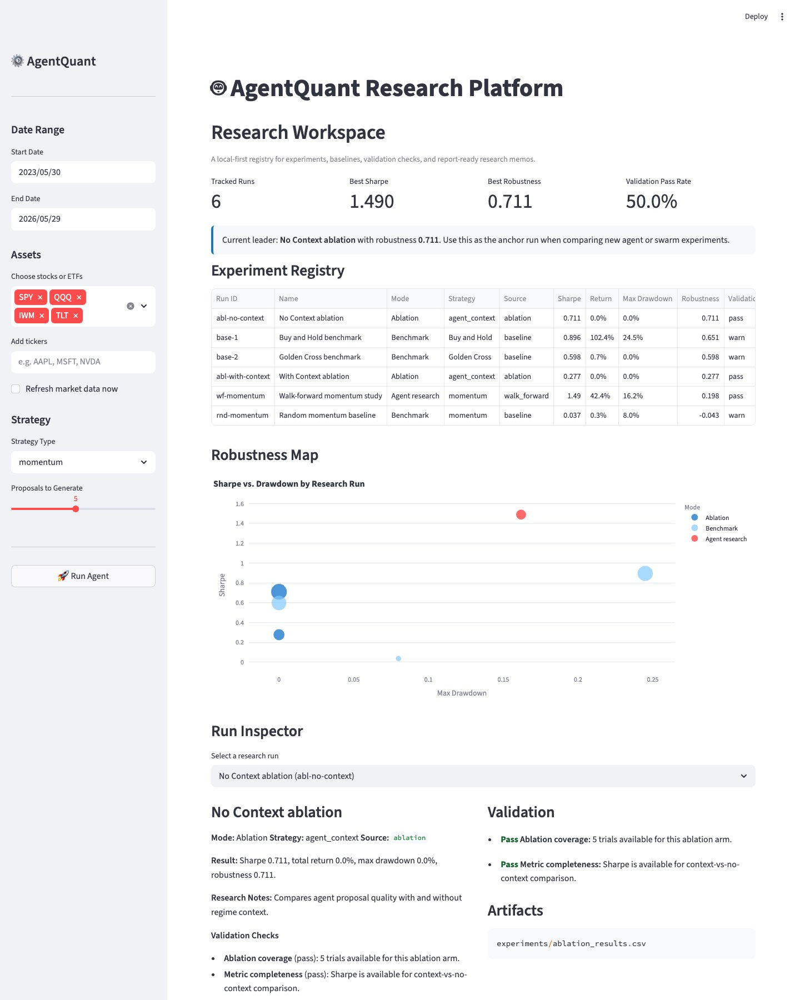
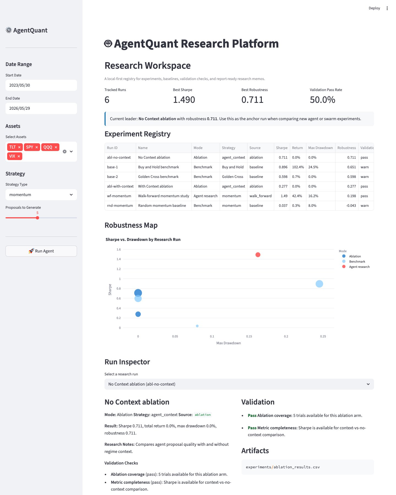
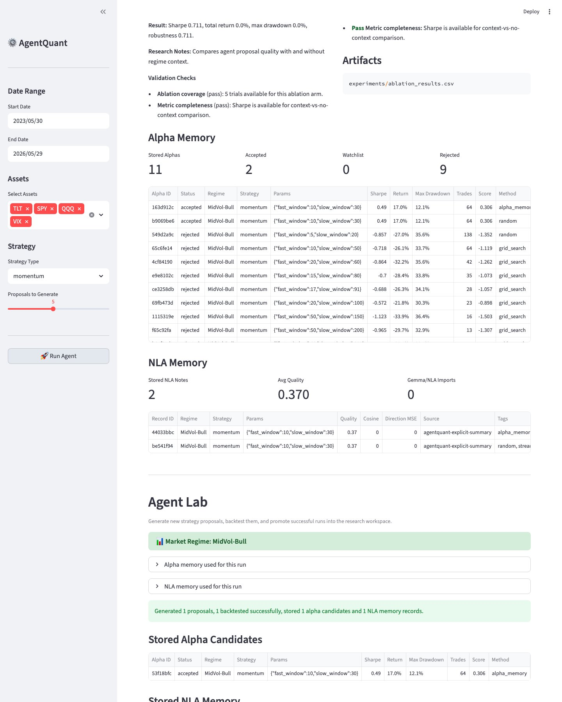
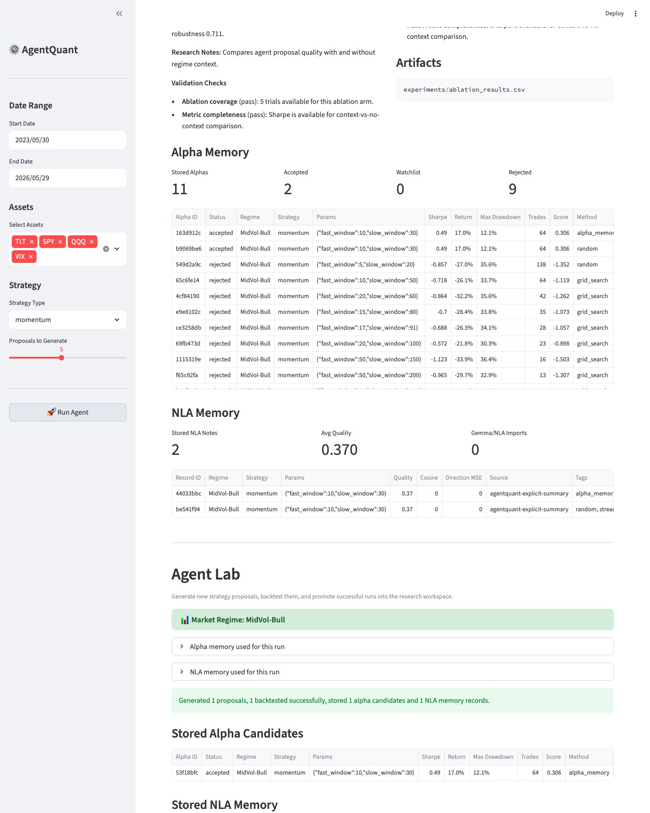
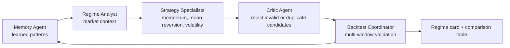

# AgentQuant: Autonomous Quantitative Research Agent

> **This is the origin story.** The repo you're in now ships
> [Peek](../README.md), a general-purpose data-leakage auditor. Peek was
> extracted from the lookback/warmup guards built for AgentQuant below — the
> autonomous research agent that follows. Everything in this document still
> lives in `src/` and is fully functional; it's preserved here as the case
> study that motivated Peek.

**A fully autonomous AI agent that researches, generates, validates, and *remembers* trading strategies.**

---

## What This Is

AgentQuant is a regime-adaptive research platform that runs a real **ReAct agent loop** — not a prompt template. Each run:

1. **Analyzes** the current market regime using VIX percentile (relative, not absolute thresholds), multi-horizon momentum, and SMA trend signals.
2. **Hypothesizes** strategy parameters via a LLM → Grid Search → Random fallback chain, constrained to a canonical `ParameterGrid` so comparisons are scientific.
3. **Backtests** all proposals in a tournament, computing Sharpe, Calmar, Sortino, max drawdown, and bootstrapped Sharpe (p5).
4. **Reflects** on results and retries if Sharpe is below the configured threshold (up to `max_iterations` times).
5. **Stores** the best result to SQLite memory so future runs can recall what worked in similar regimes.

Every completed run now emits a screenshot-friendly **regime card** and a transparent candidate table with pass/watch/reject verdicts, Sharpe, Calmar, Sortino, max drawdown, and bootstrapped Sharpe p5.

**Notably: our own rigorous walk-forward validation showed the context-aware
LLM agent *underperforming* a static baseline** (Sharpe 0.28 vs 0.71 — see
[`PAPER_DRAFT.md`](PAPER_DRAFT.md)). Chasing down exactly why led us to audit
our own backtest for leakage, which is what produced Peek.

---

## Platform Preview

### Live Data Selection

Choose a date range, select preset stocks/ETFs, or type any yfinance ticker. AgentQuant fetches data on demand and only uses the local cache when it covers the requested range.



### Research Workspace

The dashboard tracks experiment runs, baselines, robustness scores, validation checks, and report-ready research notes in one place.



### Alpha + NLA Memory

Agent Lab stores backtested alpha candidates and explicit NLA-style research narratives so future runs can retrieve prior evidence. NLA memory is based on explicit activation narratives or imported `nla-gemma4` JSONL outputs, not hidden chain-of-thought.





---

## Architecture

```
analyze ──► hypothesize ──► backtest ──► reflect
              ▲                              │
              └────────── retry if needed ◄──┘
                                             │
                                           store → SQLite memory
```

### Multi-Agent Swarm

The optional swarm mode runs the same research loop through specialized agents:



### Key Components

| Module | What it does |
|---|---|
| `src/agent/agent_graph.py` | ReAct loop with 5 typed nodes |
| `src/agent/proposal_generator.py` | LLM → Grid → Random fallback chain |
| `src/agent/base_planner.py` | `BasePlanner` ABC with Gemini / OpenAI / Fallback |
| `src/agent/context_builder.py` | `RegimeContext` dataclass with VIX percentile, multi-horizon momentum |
| `src/agent/parameter_grid.py` | Canonical grids per strategy; regime-aware prior selection |
| `src/agent/memory_layer.py` | Agentic memory layer that turns SQLite history into strategy patterns |
| `src/agent/reporting.py` | Regime card, comparison table, and pass/watch/reject verdicts |
| `src/agent/trace.py` | Live trace event stream for the ReAct loop |
| `src/agent/strategy_memory.py` | SQLite cross-session memory |
| `src/agent/swarm/` | Memory Agent, Regime Analyst, Specialists, Critic, and Backtest Coordinator |
| `src/research/alpha_store.py` | SQLite memory for accepted, watchlisted, and rejected alpha candidates |
| `src/research/nla_memory.py` | Explicit NLA-style narrative memory and `nla-gemma4` JSONL ingestion |
| `src/research/workspace.py` | Experiment registry, robustness summaries, and research memo generation |
| `src/features/regime.py` | Percentile-based regime detection + optional HMM |
| `src/features/engine.py` | RSI, MACD, Bollinger, ATR, multi-horizon vol, stationarity checks |
| `src/features/lookback_guard.py` | `WarmupEnforcer` prevents look-ahead bias — the ancestor of Peek's `causality` check |
| `src/backtest/runner.py` | Unified backtest engine with market impact + warmup enforcement |
| `src/backtest/metrics.py` | `PerformanceMetrics` — single source of truth for all metrics |
| `src/strategies/base.py` | `Strategy` ABC with `generate_signal()` returning `{-1, 0, 1}` |
| `src/strategies/strategy_registry.py` | 6 registered strategies |
| `src/utils/config.py` | Pydantic v2 validated config |
| `experiments/results_store.py` | SQLite experiment tracking with git hash |

---

### Visible Agent Loop

Run with a live terminal trace to watch the agent move through hypothesis, backtest, reflection, retry, and memory storage:

```bash
agentquant run --ticker SPY --trace
```

Run the multi-agent architecture from main:

```bash
agentquant run --ticker SPY --swarm --strategies momentum mean_reversion volatility
```

Browse accumulated strategy memory:

```bash
agentquant memory
agentquant memory --regime LowVol-Bull --patterns
agentquant memory --export markdown
```

Render the latest stored one-page regime card:

```bash
agentquant regime-card
```

The Colab quick demo is in `notebooks/agentquant_colab_spy.ipynb`. It runs a full SPY loop in three cells and works with or without a Gemini API key.

---

## Quick Start

**Prerequisites:** Python 3.10+, Google Gemini API Key (optional — works without it via grid search).

```bash
# 1. Clone
git clone https://github.com/OnePunchMonk/AgentQuant.git
cd AgentQuant

# 2. Install (core only)
pip install -e .

# 3. Install LLM support (optional)
pip install -e ".[llm]"

# 4. Configure
cp .env.example .env
# Edit .env: add GOOGLE_API_KEY and optionally FRED_API_KEY

# 5. Run the agent
python -m src.agent.runner

# Or use the CLI
agentquant run --ticker SPY --trace

# 6. Browse memory
agentquant memory --patterns

# 7. Run the dashboard
python run_app.py
```

**Without an API key:** The agent falls back to grid-search with regime-aware parameter priors. All analysis still runs.

---

## Testing

```bash
pip install -e ".[dev]"
pytest tests/ -v
```

**63 AgentQuant tests passing** (80 total in the repo, including Peek's 17) across:
- `test_config.py` — Pydantic validation
- `test_data_ingest.py` — live ticker fetch and cache range coverage
- `test_metrics.py` — Sharpe, drawdown, Calmar, Sortino
- `test_regime.py` — VIX percentile regime classification
- `test_features.py` — RSI bounds, momentum accuracy, new indicator columns
- `test_strategies.py` — All 6 strategies produce valid `{-1,0,1}` signals
- `test_backtest.py` — Runner, zero-signal flat equity, metrics keys
- `test_proposal_generator.py` — Fallback chain without API key
- `test_alpha_store.py` — alpha memory persistence and retrieval
- `test_nla_memory.py` — explicit NLA memory and JSONL ingestion
- `test_research_workspace.py` — experiment registry summaries and memos
- `test_memory_layer.py` — agentic memory pattern extraction and markdown export
- `test_reporting_cli.py` — regime card, verdicts, and CLI parsing
- `test_swarm.py` — synthetic-data smoke tests for the multi-agent swarm

---

## Project Structure

```
AgentQuant/
├── src/
│   ├── agent/
│   │   ├── agent_graph.py          # ReAct agent loop (analyze→hypothesize→backtest→reflect→store)
│   │   ├── base_planner.py         # LLM abstraction: Gemini / OpenAI / Fallback
│   │   ├── context_builder.py      # RegimeContext dataclass + builder
│   │   ├── memory_layer.py         # Agentic memory pattern extraction
│   │   ├── parameter_grid.py       # Canonical parameter grids per strategy
│   │   ├── proposal_generator.py   # LLM → Grid → Random fallback chain
│   │   ├── reporting.py            # Regime card + comparison table renderers
│   │   ├── strategy_memory.py      # SQLite cross-session memory
│   │   ├── swarm/                  # Multi-agent Memory/Regime/Critic/Backtest agents
│   │   ├── trace.py                # Live trace events
│   │   ├── tools.py                # Tool-calling interface for LangGraph
│   │   └── runner.py               # Main entry point
│   ├── data/
│   │   ├── ingest.py               # yfinance + FRED with TTL cache
│   │   └── schemas.py              # Data schemas
│   ├── research/
│   │   ├── alpha_store.py          # SQLite alpha candidate memory
│   │   ├── nla_memory.py           # Explicit NLA narrative memory
│   │   └── workspace.py            # Experiment registry + research memos
│   ├── features/
│   │   ├── engine.py               # RSI, MACD, Bollinger, ATR, multi-horizon vol
│   │   ├── regime.py               # VIX-percentile + optional HMM detection
│   │   └── lookback_guard.py       # Look-ahead bias prevention
│   ├── strategies/
│   │   ├── base.py                 # Strategy ABC + 6 concrete classes
│   │   ├── strategy_registry.py    # Registry: name → Strategy instance
│   │   ├── momentum.py             # Backward-compat shim
│   │   └── multi_strategy.py       # Backward-compat shim
│   ├── backtest/
│   │   ├── runner.py               # Unified engine: signals → equity → metrics
│   │   ├── metrics.py              # PerformanceMetrics (Sharpe, Calmar, Sortino, bootstrap)
│   │   └── simple_backtest.py      # Legacy fallback
│   ├── app/
│   │   └── streamlit_app.py        # Web dashboard
│   └── utils/
│       ├── config.py               # Pydantic AppConfig
│       ├── logging.py              # Structured logging
│       └── backtest_utils.py       # Utility functions
├── experiments/
│   ├── results_store.py            # SQLite experiment tracking
│   └── walk_forward.py             # Walk-forward validation
├── tests/                          # AgentQuant + Peek tests
├── docs/                           # Documentation
├── config.yaml                     # Project configuration
├── .env.example                    # Environment template
├── pyproject.toml                  # Dependencies + tooling
└── .github/workflows/ci.yml        # CI: Python 3.10/3.11/3.12 + ruff + pytest
```

---

## Configuration

All settings live in `config.yaml` with Pydantic validation:

```yaml
llm:
  provider: "gemini"        # gemini | openai | ollama
  model: "gemini-2.5-flash"
  temperature: 0.2

agent:
  max_iterations: 3         # max reflect-retry loops
  min_acceptable_sharpe: 0.3

backtest:
  min_warmup_periods: 252   # enforced; raises InsufficientWarmupError
  market_impact_bps: 5.0    # square-root market impact

cache:
  ttl_hours: 24
```

---

## Regime Detection

Unlike the original hardcoded VIX thresholds (>20 = HighVol, >30 = Crisis), the new detector uses:

- **VIX percentile** over the trailing 252 trading days: `Crisis` (>85th pct), `HighVol` (>65th), `MidVol` (>35th), `LowVol` (<35th)
- **3-month momentum** for trend label: `Bull` (>5%), `Bear` (<-5%), `Neutral`
- **Confidence score** = distance from percentile boundaries × distance from 0% momentum
- Optional **HMM** regime (install `hmmlearn` in `[regime]` extras)

---

> **For educational and research purposes only. Not financial advice.**
